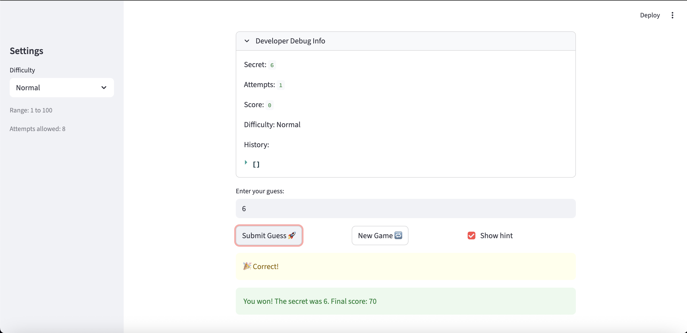

# 🎮 Game Glitch Investigator: The Impossible Guesser

## 🚨 The Situation

You asked an AI to build a simple "Number Guessing Game" using Streamlit.
It wrote the code, ran away, and now the game is unplayable. 

- You can't win.
- The hints lie to you.
- The secret number seems to have commitment issues.

## 🛠️ Setup

1. Install dependencies: `pip install -r requirements.txt`
2. Run the broken app: `python -m streamlit run app.py`

## 🕵️‍♂️ Your Mission

1. **Play the game.** Open the "Developer Debug Info" tab in the app to see the secret number. Try to win.

2. **Find the State Bug.**  
The secret number was resetting every time I clicked "Submit" because the state was not being handled properly. I fixed this by making sure the secret number is stored in `st.session_state` and only initialized once.

3. **Fix the Logic.**  
The hints were reversed. When the guess was higher than the secret, it sometimes told the user to go higher instead of lower. I fixed this by correcting the `check_guess()` logic so:
- guess > secret → "Go LOWER"
- guess < secret → "Go HIGHER"

4. **Refactor & Test.**  
I moved the core logic functions (`parse_guess`, `check_guess`, `update_score`) into `logic_utils.py` to separate logic from UI. Then I ran `pytest` and fixed issues until all tests passed.

## 📝 Document Your Experience

- [x] Describe the game's purpose.  
This game allows the user to guess a randomly generated number within a limited number of attempts. Based on the difficulty level, the range changes. The game gives feedback after each guess and tracks the score.

- [x] Detail which bugs you found.  
The main bugs were incorrect hint directions, attempts starting at the wrong number, inconsistent score updates, and issues with state causing confusing gameplay behavior.

- [x] Explain what fixes you applied.  
I corrected the hint logic, fixed the attempts counter, simplified the score system, ensured proper state handling using `st.session_state`, and refactored the code by moving logic into `logic_utils.py`.

## 📸 Demo

- 

## 🚀 Stretch Features

- [ ] [If you choose to complete Challenge 4, insert a screenshot of your Enhanced Game UI here]